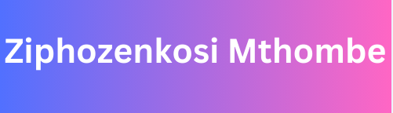

  
  
  
  

<h3 align="center">A passionate Software Engineer from South Africa</h3>
<h1 align="center">Projects</h1>

<table bordercolor="#66b2b2">
  <tr>
    <td width="50%" valign="top">
      <h3 align="center">CockTailAPI</h3>
         
        
         
        

          
    
  
      

        
<strong>Javascript, CSS, HTML</strong> - Platform that going to generate all the cockTails when you put the cockTails name and press enter , going to show you the diffent cockTails

    </td>
    <td width="50%" valign="top">
      <h3 align="center">Pokemon</h3>
         
      
         
        

          
  
  
      

        
<strong>Javascrpt, CSS and HTML</strong> - This pltform allows you to look at  150 Pokemon with image, name, id and type
        

</table>

<h1 align="center">Technologies</h1>

    
    
    
    
     
    
    
    
    
    
    
    
    
    

---

<h1 align="center">Connect</h1>

  
  
  
  

